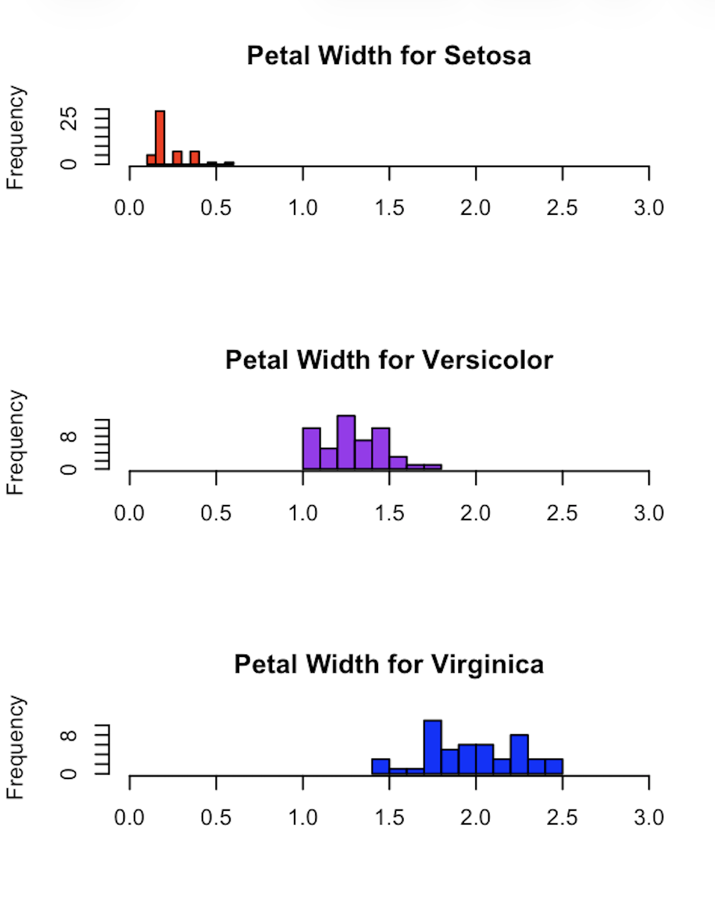

# R语言在科研场景中的实际应用
**R for Rstudio**
## 1.Plot()
> 绘图指令(plot)，即Basic X-Y Plotting，画出柱形图，散点图，箱形图等。
---
### 1.基本的可视化
#### 画数据
**仍旧以鸢尾数据为例说明各代码**
```R
# 加载数据集（包）###################################
library(datasets)  # Load/unload base packages manually
```
```R
# LOAD DATA ################################################
head(iris)
```
```R
# PLOT DATA WITH PLOT() 用plot命令画出数据

?plot  # Help for plot()在studio中得到所有plot命令

plot(iris$Species)  # Categorical variable 分类变量
plot(iris$Petal.Length)  # Quantitative variable 定量变量
plot(iris$Species, iris$Petal.Width)  # Cat x quant x轴上的分类量化（按species分，出箱形图）
plot(iris$Petal.Length, iris$Petal.Width)  # Quant pair 变量对量化（横纵坐标都有数据，出散点图）
plot(iris)  # Entire data frame 整个数据集的变量对比表
```
```R
# Plot with options 图形可调参数
plot(iris$Petal.Length, iris$Petal.Width,
  col = "#cc0000",  # Hex code for datalab.cc red 调颜色
  pch = 19,         # Use solid circles for points 把空心点变成实心
  main = "Iris: Petal Length vs. Petal Width", #设置标题
  xlab = "Petal Length", #设置x轴名称
  ylab = "Petal Width") #设置y轴名称
```
#### 画函数
```R
# PLOT FORMULAS WITH PLOT() 用plot命令画函数################
plot(cos, 0, 2*pi) #余弦（0～2pi）
plot(exp, 1, 5)#e的指数（1～5次）
plot(dnorm, -3, +3)#正态分布（-3～3）
```
```R
# Formula plot with options
plot(dnorm, -3, +3,
  col = "#cc0000",
  lwd = 5,
  main = "Standard Normal Distribution",
  xlab = "z-scores",
  ylab = "Density")
```
**清理**
```R
# CLEAN UP #################################################

# Clear packages
detach("package:datasets", unload = TRUE)

# Clear plots
dev.off()  # But only if there IS a plot

# Clear console
cat("\014")  # ctrl+L

# Clear mind :)
```
### 2.变量间的可视化-散点图
**散点图（Scatterplots）**
>作用：1.寻找两变量相关性（线性等）；2.发展、延伸趋势（扇形等）；3.异常值
---
准备
```R
# LOAD DATASETS PACKAGES 
library(datasets)  # Load/unload base packages manually

# LOAD DATA (1974年汽车道路测试数据)
?mtcars
head(mtcars) #列出所有数据
```
画图
```R
# PLOTS 
# Good to first check univariate distributions
#画图前，先看目标对象/变量的频数分布直方图以概览。
hist(mtcars$wt) #hist(数据集$变量)
hist(mtcars$mpg)
```
```R
# Basic X-Y plot for two quantitative variables
plot(mtcars$wt, mtcars$mpg) #R自动识别两个变量，并选择以最合适的散点图输出。

# Add some options 设置外观细节。
plot(mtcars$wt, mtcars$mpg,
  pch = 19,         # Solid circle
  cex = 1.5,        # Make 150% size
  col = "#cc0000",  # Red
  main = "MPG as a Function of Weight of Cars",
  xlab = "Weight (in 1000 pounds)",
  ylab = "MPG")
```
**清理**
```R
# CLEAN UP #################################################

# Clear packages
detach("package:datasets", unload = TRUE)

# Clear plots
dev.off()  # But only if there IS a plot

# Clear console
cat("\014")  # ctrl+L

# Clear mind :)
```
### 3.图像的立体化-叠加图
**叠加图（OverlayingPlots）**
>多角度，多层次且直观的数据解析-像毕加索的画。

准备
```R
# INSTALL AND LOAD PACKAGES ################################
library(datasets)  # Load/unload base packages manually
# LOAD DATA ################################################
# Annual Canadian Lynx trappings 1821-1934(加拿大猞猁数据集)
?lynx
head(lynx)
```
画图
```R
# HISTOGRAM ################################################

# Default #默认的频数分布直方图
hist(lynx)
```
设置图像细节
```R
# Add some options
hist(lynx,
     breaks = 14,          # "Suggests" 14 bins 建议分14组
     freq   = FALSE,       # Axis shows density, not freq.（设置成密度而非频率，即让输出是总分布的比例）
     col    = "thistle1",  # Color for histogram 淡紫色/粉红色
     main   = paste("Histogram of Annual Canadian Lynx",
                    "Trappings, 1821-1934"),
     xlab   = "Number of Lynx Trapped")
```
**curve()**:添加正态分布曲线
```R
# Add a normal distribution 用curve命令增加一个正态分布，在原图基础上对比差异。
curve(dnorm(x, mean = mean(lynx), sd = sd(lynx)), #使用链接数据的平均值和方差
      col = "thistle4",  # Color of curve 颜色略有不同
      lwd = 2,           # Line width of 2 pixels 线条设置为两个像素宽
      add = TRUE)        # Superimpose on previous graph 用add来画在上一个图上
```
**lines()**:添加核密度估计器（跟随数据分布走向的类钟形曲线）
```R
# Add two kernel density estimators 
lines(density(lynx), col = "blue", lwd = 2) #（标准核密度估计器，颜色，线宽）
lines(density(lynx, adjust = 3), col = "purple", lwd = 2)#（调横越的平均值/移动平均线（增加3个单位））
```
**rug()**:在每个单独数据点下加一条垂直线
```R
# Add a rug plot
rug(lynx, lwd = 2, col = "gray")
```
如常清理
```R
# CLEAN UP #################################################

# Clear packages
detach("package:datasets", unload = TRUE)  # For base

# Clear plots
dev.off()  # But only if there IS a plot

# Clear console
cat("\014")  # ctrl+L

# Clear mind :)
```
## 2.hist()
>Histograms,频数分布直方图。帮助寻找：1.分布的形状（单峰、双峰、倾斜）；2.缺口；3.异常值；4.对称性。
---
### 基本的频数分布直方图
```R
# BASIC HISTOGRAMS 
hist(iris$Sepal.Length)     #hist(数据集$对象.变量)，即定向变量。
hist(iris$Sepal.Width)
hist(iris$Petal.Length)
hist(iris$Petal.Width)
```
---
### 分组的频数分布直方图
```R
# HISTOGRAM BY GROUP
# Put graphs in 3 rows and 1 column 三行一列
par(mfrow = c(3, 1)) #先为目标输出格式分组

# Histograms for each species using options
hist(iris$Petal.Width [iris$Species == "setosa"],  #变量和行选择
  xlim = c(0, 3), #对x轴的limit，手动确保三个平行的直方图有相同的x轴刻度
  breaks = 9, #建议步长
  main = "Petal Width for Setosa", #标题
  xlab = "", #设置成无x标签（更简洁）
  col = "red") #柱形为红色

hist(iris$Petal.Width [iris$Species == "versicolor"],
  xlim = c(0, 3),
  breaks = 9,
  main = "Petal Width for Versicolor",
  xlab = "",
  col = "purple")

hist(iris$Petal.Width [iris$Species == "virginica"],
  xlim = c(0, 3),
  breaks = 9,
  main = "Petal Width for Virginica",
  xlab = "",
  col = "blue")
```
**以下为示例**

**最后别忘了恢复到默认输出模式！！！**
```R
# Restore graphic parameter 回到标准输出模式。
par(mfrow=c(1, 1))
```
## 3.summary()
>Basic Summary Function in R.
1.The idea here is something could be done after the Pictures.
2.Get some precision(精度)
---
代码仍以鸢尾为例：

准备
```R
# INSTALL AND LOAD PACKAGES ################################
library(datasets)  # Load/unload base packages manually
# LOAD DATA ################################################
head(iris)
```
三种Summary：
```R
# SUMMARY()
summary(iris$Species)       # Categorical variable 每一类别计数
summary(iris$Sepal.Length)  # Quantitative variable 获得精确的分数分布（上下四分位数，中位数，平均数等）
summary(iris)               # Entire data frame 综合前二者对整个数据表的最详细总结
```
如常清理
```R
# CLEAN UP #################################################

# Clear packages
detach("package:datasets", unload = TRUE)  # For base

# Clear plots
dev.off()  # But only if there IS a plot

# Clear console
cat("\014")  # ctrl+L

# Clear mind :)
```